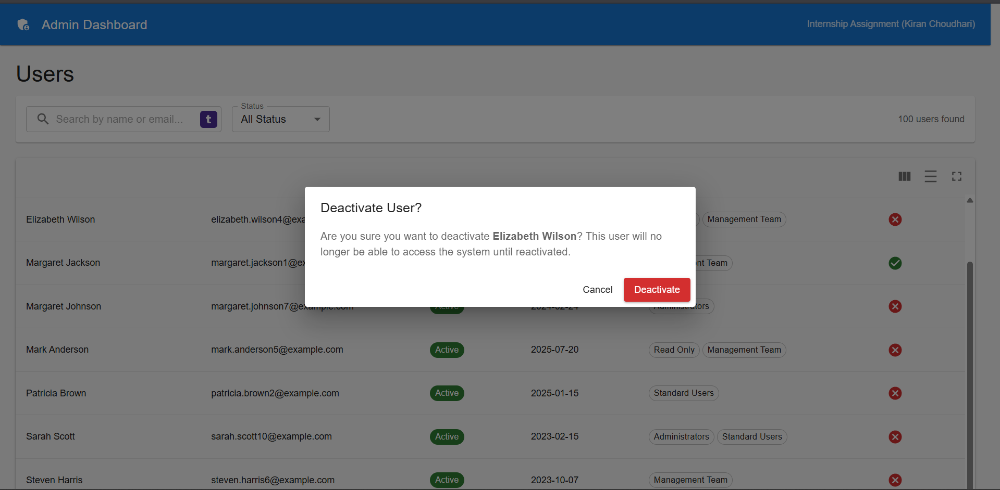

# Admin Dashboard - Internship Assignment

A pre-built admin dashboard with **intentional bugs** and **incomplete features** for you to fix and complete.

## Quick Start

```bash
# Install dependencies
npm install

# Initialize MSW (required for mock API)
npx msw init public --save

# Start development server
npm run dev
```

The app will be available at http://localhost:5173

## Tech Stack

| Technology | Purpose |
|------------|---------|
| React 18 | UI Framework |
| TypeScript | Type Safety (strict mode) |
| Material React Table (MRT) | Data Grid |
| Material UI | Component Library |
| React Query | Data Fetching & Caching |
| MSW | Mock API |
| React Router v6 | Routing |
| Notistack | Toast Notifications |

## Project Structure

```
src/
├── api/                  # API calls
├── components/
│   └── tables/           # Table components (DynamicGrid, UserActions)
├── hooks/                # Custom hooks (useUsers, useDebounce)
├── layouts/              # Page layouts
├── mocks/                # MSW mock handlers
├── pages/
│   └── UsersPage/        # Users page
├── types/                # TypeScript types
├── utils/                # Utilities & column config
├── App.tsx
├── main.tsx
└── routes.tsx
```

## Your Tasks

See **ASSIGNMENT.md** for detailed instructions.

### Summary

| Task Type | Count | Skills Tested |
|-----------|-------|---------------|
| Bug Fixes | 3 | Debugging, React Query, MRT |
| Complete Features | 3 | Pattern following |
| Build New | 2 | Independent thinking |

## Submission

1. Fix all bugs and complete features
2. Make separate commits for each fix/feature
3. Update this README with your changes
4. Deploy to Vercel/Netlify
5. Submit repo link + live demo

---

## 🚀 Submission Details

**Live Demo**: [https://vegam-solutions-task.vercel.app/](https://vegam-solutions-task.vercel.app/)


### ✅ Submission Checklist

#### 1. Bug Fixes
- [x] **Cache Invalidation**: Fixed `useUpdateUserStatus` to properly invalidate queries after mutation.
- [x] **Chiplist Renderer**: Implemented `renderCellByType` in `DynamicGrid` to display user groups.
- [x] **URL Sync**: Implemented two-way binding between URL and application state.

#### 2. Core Features
- [x] **Debounced Search**: Integrated `useDebounce` hook (300ms) to optimize API calls.
- [x] **Loading Skeletons**: Added `TableSkeleton` component for better UX.
- [x] **Optimistic UI**: Implemented instant feedback with rollback on error.

#### 3. Bonus Features
- [x] **Bonus A (Deployment)**: Successfully deployed to Vercel with SPA routing configuration.
- [x] **Bonus B (Unit Testing)**: Added Vitest setup with comprehensive tests for `UserActions` and utilities.


## High Level Design (HLD)

### 1. Architecture Overview
The application follows a standard **Single Page Application (SPA)** architecture using **React**, optimized for direct interaction with APIs and managing client-side state efficiently.

- **Frontend**: React (Vite)
- **State Management**: React Query (Server State) & React Local State (UI State)
- **Routing**: React Router v6
- **UI Component Library**: Material UI (MUI) & Material React Table
- **Mocking**: MSW (Mock Service Worker) intercepts network requests to simulate a backend.

### 2. Key Components & Data Flow

#### A. Data Layer (`/api`, `/hooks`)
- **API Client**: `userApi.ts` handles REST calls.
- **Server State**: `useUsers`, `useUpdateUserStatus` hooks wrap React Query logic to manage caching, fetching, loading states, and optimistic UI updates.
- **Mocking**: `msw` intercepts these fetch calls in the browser to return mock data (`/mocks`), closely mimicking a real production API (latency, errors).

#### B. Presentation Layer (`/pages`, `/components`)
- **UsersPage**: The main view controller. It maintains local state for searching, filtering, and pagination, syncing these with URL parameters for shareability.
- **DynamicGrid**: A reusable, metadata-driven table component. It generates columns dynamically based on a config object (`columnConfig.ts`) rather than hard-coded table rows, allowing for scale and flexibility.
- **UserActions**: Handles specific user interactions (Activate/Deactivate) with safeguards like confirmation dialogs.

#### C. Cross-Cutting Concerns
- **Error Handling**: `ErrorBoundary` catches UI crashes, while `ErrorDisplay` manages API failure states.
- **Notifications**: `Notistack` provides transient feedback (toasts) for user actions.
- **Theme**: Centralized MUI theme configuration in `App.tsx`.

### 3. Application Flow
1.  **Initialization**: `main.tsx` initializes the MSW worker. Once the worker is ready, the React app mounts.
2.  **Routing**: `routes.tsx` defines the layout structure (`MainLayout`) and renders `UsersPage` for the `/` and `/users` routes.
3.  **Data Fetching**:
    - `UsersPage` calls `useUsers` with current filter params.
    - `useUsers` triggers a React Query fetch.
    - MSW intercepts the request and returns paginated JSON data.
4.  **Interaction**:
    - **Search/Filter**: Updates local state -> Debounce -> Updates URL -> Triggers Refetch.
    - **Action (e.g., Deactivate)**: Button Click -> Confirmation Dialog -> Mutation (Optimistic Update) -> Toast Notification -> Cache Invalidation.

### 4. Folder Structure Rationale
- `components/tables`: Specialized complex components for data display.
- `hooks`: Encapsulates business logic and side effects, keeping components clean.
- `utils`: Pure functions and configuration (e.g., `columnConfig`) separate from UI logic.

### 📸 Screenshots

| Dashboard (Users Page) | User Actions |
|:---:|:---:|
|  |  |
| *Main User Grid with Search & Filters* | *Active/Inactive Status Toggle with Confirmation* |
