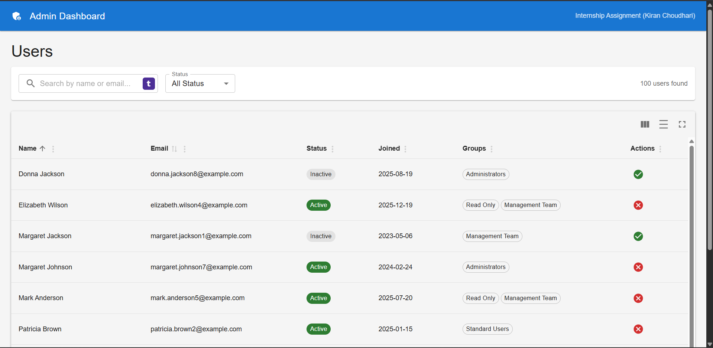
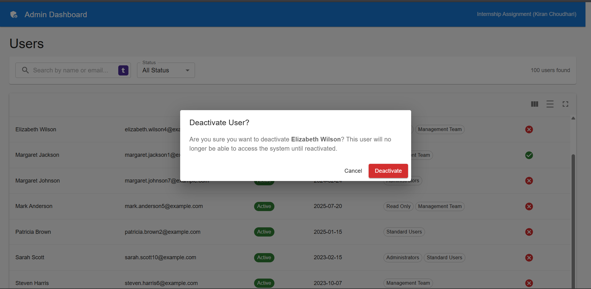

# Admin Dashboard - Internship Assignment

A pre-built admin dashboard with **intentional bugs** and **incomplete features** for you to fix and complete.

## Quick Start

```bash
# Install dependencies
npm install

# Initialize MSW (required for mock API)
npx msw init public --save

# Start development server
npm run dev
```

The app will be available at http://localhost:5173

## Tech Stack

| Technology | Purpose |
|------------|---------|
| React 18 | UI Framework |
| TypeScript | Type Safety (strict mode) |
| Material React Table (MRT) | Data Grid |
| Material UI | Component Library |
| React Query | Data Fetching & Caching |
| MSW | Mock API |
| React Router v6 | Routing |
| Notistack | Toast Notifications |

## Project Structure

```
src/
├── api/                  # API calls
├── components/
│   └── tables/           # Table components (DynamicGrid, UserActions)
├── hooks/                # Custom hooks (useUsers, useDebounce)
├── layouts/              # Page layouts
├── mocks/                # MSW mock handlers
├── pages/
│   └── UsersPage/        # Users page
├── types/                # TypeScript types
├── utils/                # Utilities & column config
├── App.tsx
├── main.tsx
└── routes.tsx
```

## Your Tasks

See **ASSIGNMENT.md** for detailed instructions.

### Summary

| Task Type | Count | Skills Tested |
|-----------|-------|---------------|
| Bug Fixes | 3 | Debugging, React Query, MRT |
| Complete Features | 3 | Pattern following |
| Build New | 2 | Independent thinking |

## Submission

1. Fix all bugs and complete features
2. Make separate commits for each fix/feature
3. Update this README with your changes
4. Deploy to Vercel/Netlify
5. Submit repo link + live demo

---

## Changes Made

### Live Demo

**[View Live Application](https://vegam-solutions-task.vercel.app/)**

---

### Bug Fixes

| Issue | Solution | File(s) Modified |
|-------|----------|------------------|
| Cache not invalidating after status update | Added `queryClient.invalidateQueries` after mutation success | `useUsers.ts` |
| User groups not rendering as chips | Implemented `chiplist` type handler in `renderCellByType` | `DynamicGrid.tsx` |
| URL state not syncing with filters | Added two-way binding between URL params and component state | `UsersPage.tsx` |

### Core Features Implemented

| Feature | Description | Implementation |
|---------|-------------|----------------|
| Debounced Search | 300ms delay to reduce API calls during typing | `useDebounce` hook integration |
| Loading Skeletons | Visual feedback while data loads | `TableSkeleton` component |
| Optimistic UI | Instant visual feedback with automatic rollback on error | React Query mutation callbacks |

### Error Handling

| Feature | Description |
|---------|-------------|
| **Offline Detection** | Global banner appears when internet connection is lost, auto-dismisses when restored |
| **Smart Error Messages** | Context-aware error messages based on error type (network, server, timeout, auth, etc.) |
| **Retry Buttons** | One-click retry for failed API calls and mutations |
| **Action Recovery** | Failed actions are tracked and can be retried when connection is restored |
| **Error Boundaries** | Graceful crash recovery with user-friendly fallback UI |

**Supported Error Types:**
- Network/Connection errors
- Server errors (500, 502, 503, 504)
- Timeout errors
- Authentication (401) & Authorization (403) errors
- Not Found (404) errors
- Rate limiting (429) errors
- Validation errors (400)
- CORS errors

### Bonus Features

| Feature | Status | Details |
|---------|--------|---------|
| Deployment | Complete | Vercel with SPA routing (`vercel.json`) |
| Unit Testing | Complete | Vitest + React Testing Library |

---

## Architecture

### Overview

```
┌─────────────────────────────────────────────────────────────────┐
│                        Browser (SPA)                            │
├─────────────────────────────────────────────────────────────────┤
│  React Router v6  │  React Query  │  Material UI + MRT          │
├─────────────────────────────────────────────────────────────────┤
│                     MSW (Mock Service Worker)                   │
└─────────────────────────────────────────────────────────────────┘
```

### Data Flow

```
User Action → Component State → useDebounce → URL Update → useUsers Hook
                                                              ↓
                                              React Query Fetch
                                                              ↓
                                              MSW Intercept → Mock Response
                                                              ↓
                                              Cache Update → UI Re-render
```

### Key Components

| Layer | Component | Responsibility |
|-------|-----------|----------------|
| **Data** | `userApi.ts` | REST API calls |
| **Data** | `useUsers.ts` | Server state management, caching, optimistic updates |
| **Data** | `useOnlineStatus.ts` | Network connectivity detection |
| **UI** | `UsersPage.tsx` | Page controller, URL sync, filter state |
| **UI** | `DynamicGrid.tsx` | Metadata-driven table rendering |
| **UI** | `UserActions.tsx` | Status toggle with confirmation dialogs |
| **Error** | `ErrorBoundary.tsx` | Catches React errors, provides recovery UI |
| **Error** | `ErrorDisplay.tsx` | User-friendly error messages with retry |
| **Error** | `OfflineBanner.tsx` | Global offline/online status indicator |

### Design Decisions

- **Config-driven columns**: `columnConfig.ts` defines table structure, enabling easy modification without touching component code
- **Separation of concerns**: Hooks handle data logic, components handle presentation
- **Error boundaries**: Graceful degradation with `ErrorBoundary` and `ErrorDisplay` components
- **Toast notifications**: `Notistack` for non-blocking user feedback

---

## Screenshots

| Dashboard | User Actions |
|:---------:|:------------:|
|  |  |
| Main user grid with search and filters | Status toggle with confirmation dialog |
